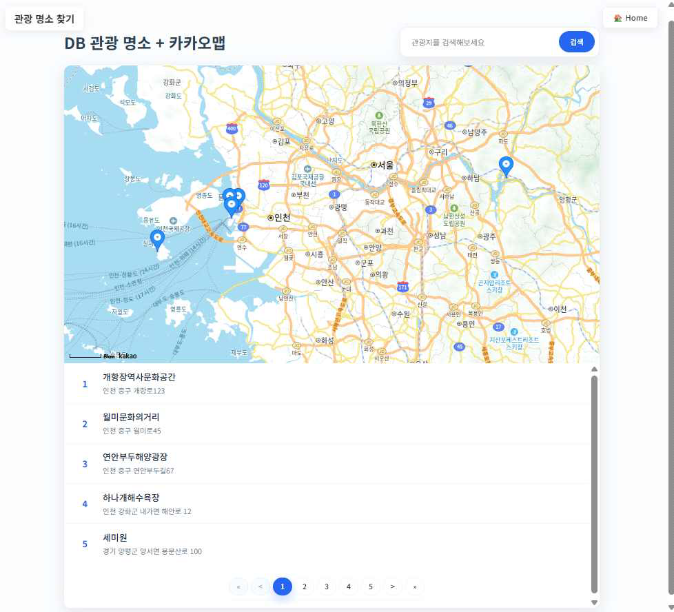

# Travel Project

##
## 📜 프로젝트 개요


**DB 관광 명소 + 카카오맵**은 데이터베이스에 저장된 관광 명소 정보를 카카오맵 API와 연동하여 사용자에게 보여주는 웹 애플리케이션입니다.

이 프로젝트는 사용자가 키워드를 통해 원하는 관광 명소를 검색하고, 지도 위에서 위치를 확인하며, 관련 이미지와 상세 정보를 찾아볼 수 있도록 제작되었습니다.

비동기 통신(AJAX)을 활용하여 페이지 새로고침 없이 동적으로 데이터를 로드하고 사용자 경험을 향상시키는 데 중점을 두었습니다.

##
## ✨ 주요 기능

* **관광 명소 검색**: 키워드를 입력하여 관광 명소의 이름 또는 주소로 명소를 검색할 수 있습니다.
* **카카오맵 연동**: 검색된 관광 명소의 위치를 카카오맵에 마커로 표시합니다.
* **동적 리스트 및 페이지네이션**: 검색 결과는 페이지네이션을 통해 나누어 보여주며, 페이지 이동 시에도 비동기적으로 데이터를 로드하여 부드러운 사용자 경험을 제공합니다.
* **상세 정보 및 이미지**: 각 관광 명소의 상세 설명과 관련 이미지를 제공합니다. 이미지는 외부 API(공공데이터포털 - 사진갤러리 정보)를 통해 동적으로 가져옵니다.
* **반응형 UI**: 지도는 화면의 55%, 장소 목록은 45%를 차지하도록 구성하여 사용자가 정보를 쉽게 파악할 수 있도록 했습니다.

##
## 🛠️ 사용 기술

* **Backend**: Java, Spring Boot
* **Frontend**: HTML, CSS, JavaScript, Thymeleaf
* **Database**: MySQL
* **ORM**: MyBatis
* **Build Tool**: Gradle
* **API**: Kakao Maps API, 공공데이터포털 API
* **Library**: Lombok, JSON

##
## 데이터베이스 설정

```
spring.datasource.url=jdbc:mysql://localhost:3306/traveldb?useSSL=false&allowPublicKeyRetrieval=true&serverTimezone=Asia/Seoul
spring.datasource.username=[DB 사용자명]
spring.datasource.password=[DB 비밀번호]
```

##
## API 키 설정

카카오맵 API: src/main/resources/templates/index.html 파일에서 발급받은 카카오맵 JavaScript API 키를 입력합니다.


```
<script src="[https://dapi.kakao.com/v2/maps/sdk.js?appkey=](https://dapi.kakao.com/v2/maps/sdk.js?appkey=)[카카오맵 API 키]&libraries=services"></script>
공공데이터포털 API: src/main/java/com/multi/travel/controller/AsyncController.java 파일에서 발급받은 공공데이터포털 서비스 키를 입력합니다.
```
Java
```
private final String serviceKey = "[공공데이터포털 서비스 키]";
```
##
## 📁 파일 구조
```
├── .gitattributes
├── .gitignore
├── build.gradle
├── gradle
│   └── wrapper
│       ├── gradle-wrapper.jar
│       └── gradle-wrapper.properties
├── gradlew
├── gradlew.bat
├── settings.gradle
└── src
    ├── main
    │   ├── java
    │   │   └── com
    │   │       └── multi
    │   │           └── travel
    │   │               ├── controller
    │   │               │   ├── AsyncController.java
    │   │               │   └── TourController.java
    │   │               ├── mapper
    │   │               │   └── TourismMapper.java
    │   │               ├── service
    │   │               │   └── TourismService.java
    │   │               ├── support
    │   │               │   ├── NearBy.java
    │   │               │   └── Pagination.java
    │   │               ├── vo
    │   │               │   ├── PageResponseVO.java
    │   │               │   └── TourismVO.java
    │   │               └── TravelApplication.java
    │   └── resources
    │       ├── application.properties
    │       ├── mapper
    │       │   └── TourismMapper.xml
    │       └── templates
    │           └── index.html
    └── test
        └── java
            └── com
                └── multi
                    └── travel
                        └── TravelApplicationTests.java
```

## 🌐 API 엔드포인트

### TourController
- `GET /`: 메인 페이지를 반환합니다.
- `GET /tour`: 관광 명소 상세 페이지를 반환합니다.
    - **Parameter:** `no` (관광 명소 번호)

### AsyncController
- `GET /api/tours`: 관광 명소 목록을 비동기적으로 조회합니다.
    - **Parameters:**
        - `page` (페이지 번호, 기본값: 1)
        - `size` (페이지 크기, 기본값: 5)
        - `keyword` (검색 키워드)
- `GET /api/img`: 관광 명소의 이미지를 비동기적으로 조회합니다.
    - **Parameter:** `no` (관광 명소 번호)
##